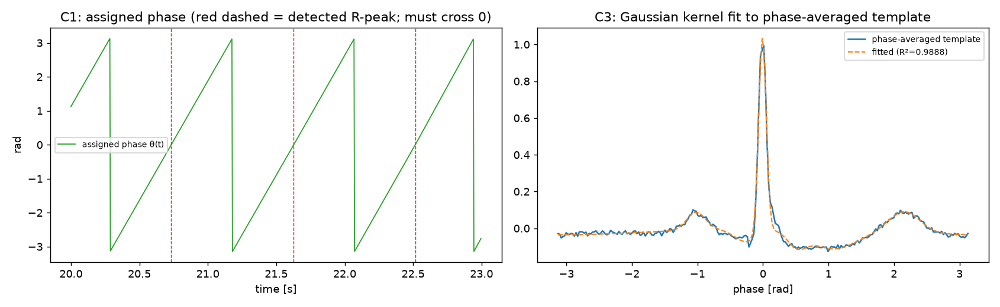

# 06. Sameni EKF/EKS 자가진단

> 자동 생성: `python scripts/diagnose_sameni.py`

## 왜 이 문서가 필요한가

프로젝트 초기에 "Sameni 방식이 기대만큼 개선되지 않는다" 는 관찰이 있었다.
그러나 **약하게 구현된 baseline 을 두고 다른 방법이 이겼다고 결론내면 그 비교는 무효다.**
그래서 비교 실험에 넣기 전에 아래 6개 항목을 자동으로 점검한다.

**결과: 6/6 통과** (그 외 1 항목은 이 데이터축에 해당 없음)

| # | 항목 | 결과 | 상세 |
|---|---|---|---|
| `C1` | 위상 0-crossing 이 R-peak 와 일치 | **PASS** | median |Δ| = 0.00 ms (≤ 10 ms), zero-crossing 105 개 / R-peak 105 개 |
| `C2` | front-end HPF 를 EKF 앞단에 적용 | **PASS** | baseline wander 포함 조건: FE-ON +8.51 dB vs FE-OFF +3.03 dB (차이 +5.48 dB) |
| `C3` | phase-averaged template 에 Gaussian 적합 | **PASS** | R² = 0.9888 (> 0.98), 커널 7개 |
| `C4` | 측정잡음 R 추정 | **PASS** | 추정/참값 = -2.86 dB (|·| ≤ 3 dB) |
| `C5` | EKS(평활) 가 EKF(전방) 보다 우수 | **PASS** | EKF +10.83 dB → EKS +11.23 dB (차이 +0.41 dB) |
| `C6` | 진폭 정규화/역정규화 | **PASS** | gain_bias = 0.9739 (0.9 ~ 1.1) |
| `DoD` | 생성 커널 주입 (합성축 전용 검사) | **— N/A** | +5.91 dB — 실기록에는 '참 커널' 이 없어 이 값은 천장이 아니다 (적합 커널 +11.23 dB 가 더 낫다) |



## 구현 과정에서 실제로 발견된 버그 2개

이 진단 절차가 없었다면 놓쳤을 것들이다. 둘 다 성능을 10 dB 이상 떨어뜨렸다.

### (a) phase-averaged template 의 상수 오프셋

상태방정식은 `dz/dθ` 만 규정하므로 **z 의 상수 오프셋은 동역학과 무관**하다.
그런데 front-end HPF 가 DC 를 제거한 신호와 오프셋이 있는 커널 합을 그대로 비교하면
적합 R² 가 0.99 → 0.82 로 떨어지고, 그 잔차가 그대로 `q_z` 과대추정으로 이어진다.
→ template 과 커널 합 양쪽의 평균을 제거하고 적합한다.

### (b) `q_z` 를 누적 분산으로 잘못 계산

`q_z` 는 **매 샘플의** 상태잡음 분산인데, 관측되는 모델 잔차는
beat 한 개 길이 `L` 동안 **누적된** 편차다 (위상이 beat 마다 재고정되므로).
random walk 의 누적 분산은 `L · q_z` 이므로 `L` 로 나눠야 한다.
이 정규화를 빼면 `q_z` 가 수백 배 과대추정되어 필터가 사실상 평활화를 하지 않는다.

> 위 두 버그의 수정 전후 대조는 합성축에서 이뤄졌다. `docs/06_sameni_diagnosis.md` 를 볼 것.

## 결론

- 생성 커널 주입 시 +5.91 dB, template 적합 시 +11.23 dB.
- **주입 커널이 적합 커널보다 5.32 dB 나쁘다.** 이 축에서는 `DEFAULT_KERNEL` 이 '참 파라미터' 가 아니기 때문이다 — 실제 ECG 에 대응하는 McSharry 참 파라미터는 존재하지 않는다. 따라서 주입값을 성능의 천장으로 읽으면 안 된다 (F-17).
- EKS 는 EKF 대비 +0.41 dB 우수하다. **EKF 만 쓰면 안 된다.**

## 재현

```bash
python scripts/diagnose_sameni.py --data mitdb
```
