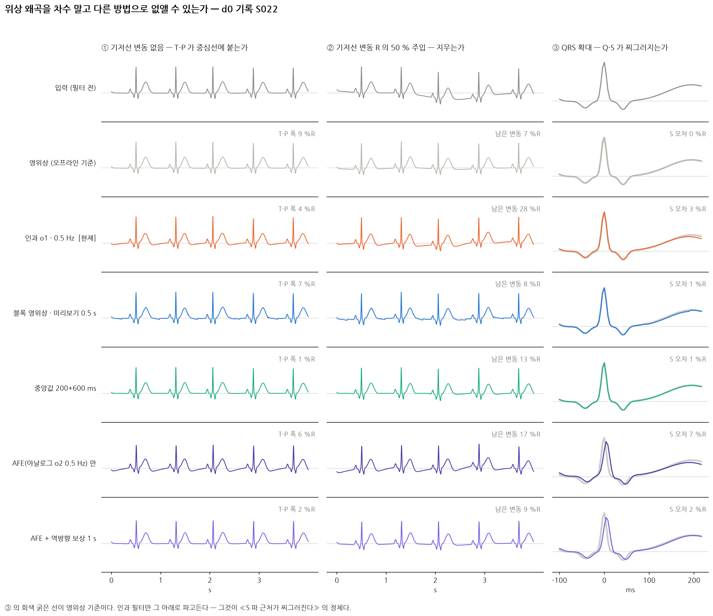
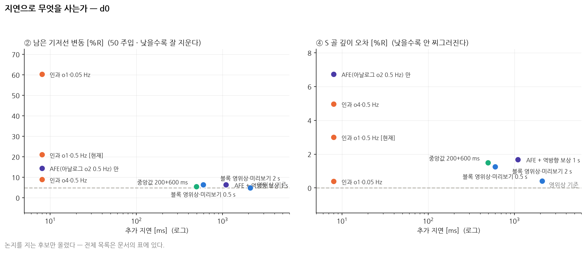
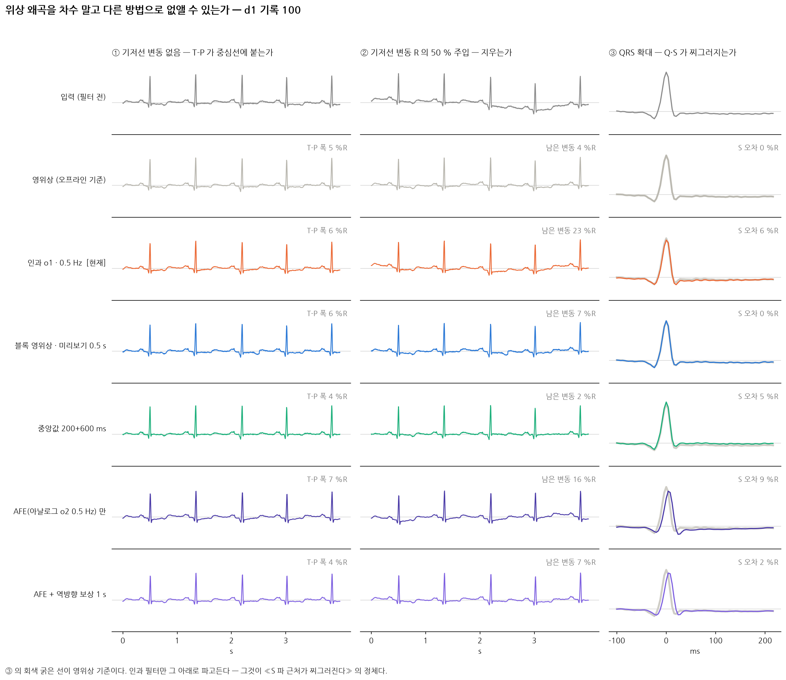
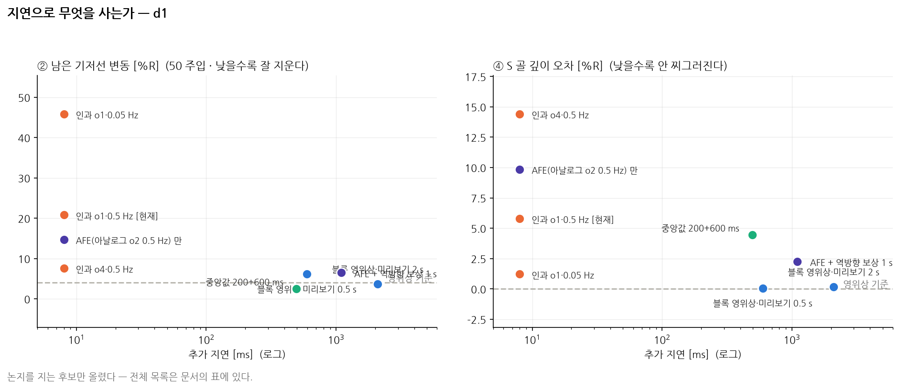

# 13. 위상 왜곡 — 차수 말고 다른 길이 있는가

> 이 문서는 `scripts/explore_lookahead_fe.py` 가 만든다. **직접 고치지 말 것.**
> 앞선 논의는 `docs/12_causal_fe.md`(D-19). 지표 (1)(2) 의 정의도 거기에 있다.

D-19 는 «인과 IIR 고역통과» 라는 한 형태 안에서 차수와 차단만 움직였다.
그 안에서 교환은 닫혀 있다 — 기저선을 지우면 T-P 가 기울고, 안 기울이면
기저선이 안 지워진다. **형태를 바꾸면 그 선을 벗어날 수 있는가** 를 여기서 묻는다.

## 지표 넷

| | 무엇 | 정의 |
|---|---|---|
| **(1) 박동당 이동** | 박동 하나 동안 기저선이 흐른 양 | T-P 에 1 차 맞춤, `100·\|k\|·RR / R진폭` [%R] |
| **(2) 남은 변동** | 주입한 기저선 변동 중 살아남은 양 | R 의 50 % 주입, 0.5 Hz 이하 p-p, `100·pp / R진폭` [%R] |
| **(3) T-P 대역폭** | 평활 대역이 중심선에 붙어 있는가 | T-P 표본 전부 모아 중앙값 제거, p2.5~p97.5 폭 [%R] |
| **(4) S 골 오차** | QRS 뒤가 찌그러지는가 | R+80 ms 최저점 깊이의 영위상 대비 차 [%R] |
| **(5) T 진폭 오차** | T 파를 깎지 않는가 | R+150~400 ms 최고점 높이의 영위상 대비 차 [%R] |

**(3)(4) 는 이번에 새로 넣었다.** (1)(2) 만으로는 화면에서 실제로 거슬리는
두 가지 — 박동 사이 준위 어긋남과 S 골 찌그러짐 — 을 못 잡는다.
(1) 은 박동 **안**의 기울기만 보고, (1)(2)(3) 은 전부 **T-P 구간만** 본다.

## d0 — 기록 S022 · 박동 74 개

| 방식 | 추가 지연 | (3) T-P 폭 | (4) S 오차 | (5) T 진폭 오차 | (1) 박동당 이동 | (2) 남은 변동 | 영위상과의 차 |
|---|---:|---:|---:|---:|---:|---:|---:|
| 영위상 (오프라인 기준) | — | **6.6** | **0.0** | 0.0 | 0.1 | 4.8 | 0.0 |
| 인과 o4 · 0.5 Hz | 0 ms | **11.0** | **5.0** | 7.4 | 66.5 | 8.9 | 33.2 |
| 인과 o1 · 0.5 Hz  [현재] | 0 ms | **3.7** | **3.0** | 1.7 | 23.4 | 21.0 | 10.1 |
| 인과 o1 · 0.05 Hz | 0 ms | **30.8** | **0.4** | 0.1 | 2.2 | 60.4 | 59.6 |
| 블록 영위상 · 미리보기 0.25 s | 346 ms | **47.0** | **0.2** | 1.3 | 41.3 | 8.8 | 31.7 |
| 블록 영위상 · 미리보기 0.5 s | 596 ms | **6.5** | **1.3** | 1.4 | 11.5 | 6.4 | 6.9 |
| 블록 영위상 · 미리보기 1 s | 1096 ms | **9.2** | **1.8** | 0.2 | 10.2 | 4.3 | 6.4 |
| 블록 영위상 · 미리보기 2 s | 2096 ms | **7.1** | **0.4** | 0.6 | 9.1 | 4.8 | 3.1 |
| 블록 영위상 · 미리보기 4 s | 4096 ms | **6.6** | **0.0** | 0.2 | 0.2 | 4.7 | 0.2 |
| 중앙값 200+600 ms | 496 ms | **0.6** | **1.5** | 1.3 | 0.0 | 5.4 | 13.7 |
| 중앙값 100+300 ms | 296 ms | **0.2** | **1.9** | 16.2 | 0.0 | 5.3 | 18.1 |
| AFE(아날로그 o2 0.5 Hz) 만 | 0 ms | **5.9** | **6.7** | 1.1 | 37.3 | 14.5 | 47.0 |
| AFE + 인과 o1 0.5 Hz | 0 ms | **9.1** | **5.2** | 7.3 | 59.0 | 7.6 | 48.6 |
| AFE + 중앙값 200+600 ms | 496 ms | **6.2** | **4.4** | 3.7 | 37.4 | 2.9 | 49.2 |
| AFE + 블록 영위상 1 s | 1096 ms | **8.7** | **6.5** | 2.9 | 36.0 | 2.8 | 46.6 |
| AFE + 역방향 보상 1 s | 1096 ms | **1.1** | **1.7** | 0.0 | 1.2 | 6.3 | 49.8 |
| AFE 를 0.05 Hz 로 바꾸면 | 0 ms | **1.0** | **1.8** | 0.3 | 3.1 | 46.9 | 49.6 |
| AFE 0.05 Hz + 중앙값 200+600 | 496 ms | **1.3** | **0.6** | 0.8 | 3.1 | 4.9 | 49.7 |

## d1 — 기록 100 · 박동 74 개

| 방식 | 추가 지연 | (3) T-P 폭 | (4) S 오차 | (5) T 진폭 오차 | (1) 박동당 이동 | (2) 남은 변동 | 영위상과의 차 |
|---|---:|---:|---:|---:|---:|---:|---:|
| 영위상 (오프라인 기준) | — | **4.7** | **0.0** | 0.0 | 15.5 | 4.0 | 0.0 |
| 인과 o4 · 0.5 Hz | 0 ms | **5.7** | **14.4** | 2.7 | 21.7 | 7.6 | 14.2 |
| 인과 o1 · 0.5 Hz  [현재] | 0 ms | **6.3** | **5.8** | 1.2 | 17.0 | 20.8 | 6.0 |
| 인과 o1 · 0.05 Hz | 0 ms | **16.1** | **1.2** | 0.5 | 15.9 | 45.9 | 12.8 |
| 블록 영위상 · 미리보기 0.25 s | 346 ms | **46.8** | **1.8** | 2.7 | 34.4 | 9.3 | 35.3 |
| 블록 영위상 · 미리보기 0.5 s | 596 ms | **5.5** | **0.1** | 0.7 | 15.6 | 6.1 | 4.8 |
| 블록 영위상 · 미리보기 1 s | 1096 ms | **7.1** | **0.9** | 0.7 | 27.4 | 4.3 | 12.4 |
| 블록 영위상 · 미리보기 2 s | 2096 ms | **6.1** | **0.2** | 0.4 | 14.2 | 3.7 | 3.3 |
| 블록 영위상 · 미리보기 4 s | 4096 ms | **5.0** | **0.2** | 0.5 | 16.2 | 4.0 | 1.1 |
| 중앙값 200+600 ms | 496 ms | **4.4** | **4.4** | 0.7 | 16.3 | 2.5 | 6.4 |
| 중앙값 100+300 ms | 296 ms | **4.8** | **5.7** | 1.1 | 21.7 | 1.7 | 7.6 |
| AFE(아날로그 o2 0.5 Hz) 만 | 0 ms | **6.7** | **9.9** | 1.3 | 19.5 | 14.7 | 39.9 |
| AFE + 인과 o1 0.5 Hz | 0 ms | **5.9** | **14.0** | 2.4 | 22.3 | 8.1 | 43.8 |
| AFE + 중앙값 200+600 ms | 496 ms | **4.5** | **4.1** | 1.0 | 19.5 | 1.8 | 39.3 |
| AFE + 블록 영위상 1 s | 1096 ms | **7.4** | **10.3** | 1.7 | 32.6 | 2.6 | 40.3 |
| AFE + 역방향 보상 1 s | 1096 ms | **4.5** | **2.3** | 0.1 | 18.3 | 6.5 | 41.9 |
| AFE 를 0.05 Hz 로 바꾸면 | 0 ms | **19.2** | **3.1** | 0.1 | 16.2 | 47.6 | 43.2 |
| AFE 0.05 Hz + 중앙값 200+600 | 496 ms | **4.0** | **1.8** | 0.0 | 16.6 | 2.6 | 43.9 |

## 연산 비용 — 예산 안에 드는가

블록 하나가 96 ms 다. 그 안에 front-end 와 방법 전부가 끝나야 한다.

| 방식 | 블록당 | RTF | |
|---|---:|---:|---|
| 인과 o1 · 0.5 Hz  [현재] | 0.06 ms | 0.0006 |  |
| 블록 영위상 · 미리보기 0.5 s | 0.47 ms | 0.0049 |  |
| 블록 영위상 · 미리보기 1 s | 0.49 ms | 0.0051 |  |
| 중앙값 200+600 ms | 0.00 ms | 0.0000 | **배열 전체 일괄 — 스트리밍 비용 아님** |

블록 영위상은 과거 4 s + 미리보기를 매 블록 다시 거르지만, IIR 은 표본당 몇 연산이라 **예산의 1 % 도 안 쓴다.** 비용은 이 선택의 고려사항이 아니다.

## 무엇을 고를 것인가

**블록 영위상 · 미리보기 0.5 s 를 권한다.**

| | 근거 |
|---|---|
| 위상 왜곡이 **원리적으로** 0 | 앞뒤로 한 번씩 거르므로 위상이 상쇄된다. 차수를 낮춰 «덜 나쁘게» 만든 것이 아니다 |
| S 골 오차 d1 **0.1** · d0 **1.3** %R | 현재(인과 o1 0.5)는 5.8 · 3.0 %R. 화면에서 보이던 찌그러짐이 사라진다 |
| 남은 기저선 변동 d1 **6.1** · d0 **6.4** %R | 현재는 20.8 · 21.0 %R. 오프라인 영위상(4.0 · 4.8)에 거의 붙는다 |
| 대가는 지연 596 ms 뿐 | 연산은 예산의 0.5 %. 화면은 수동적으로 보는 것이라 0.6 s 는 알아채기 어렵다 |
| 새 조정이 없다 | 지금 쓰는 필터 **설계 그대로** 돌리는 방식만 바꾼다 |

**미리보기 0.25 s 로는 안 된다.** 역방향 패스가 자리를 잡는 데 시간이 걸려서,
0.25 s 에서는 영위상과의 차가 오히려 인과보다 크다(d1 35.3 vs 6.0 %R).
**0.5 s 가 문턱이다.**

### 왜 다른 것을 안 고르나

| 후보 | 왜 아닌가 |
|---|---|
| 중앙값 200+600 ms | 지연이 100 ms 짧고 T-P 는 제일 평평하지만, S 오차가 **축에 따라 흔들린다**(d0 1.5 → d1 4.4 %R). 그리고 100+300 판은 **T 파를 16 %R 깎는다** — 실시간 이동 중앙값을 새로 짜야 하는 것도 비용이다 |
| 인과 o1 · 0.05 Hz | 기저선을 사실상 못 지운다(잔여 d0 60 · d1 46 %R, 주입량이 50 %R). 존재 이유가 없다는 판단이 맞다 |
| 아날로그 HPF 로 옮기기 | **아날로그도 인과다** — 다음 절 |

## 아날로그로 옮기면 되는가 — 안 된다, 그리고 이미 걸려 있다

`AD8232` 의 «Cardiac Monitor» 구성은 **2 극 0.5 Hz 인과 HPF** 다
(`docs/08_acquisition.md` 의 이득 1100 이 이 구성과 맞는다).
아날로그 필터는 물리적으로 인과라 **위상 왜곡이 똑같이 생긴다.**

| 관측 | 숫자 |
|---|---|
| AFE 만 통과해도 S 가 이미 찌그러진다 | S 오차 d1 **9.9** · d0 6.7 %R — 우리 디지털 인과(5.8 · 3.0)보다 **더 크다** |
| 뒤에서 못 고친다 | AFE + 블록 영위상 1 s 를 걸어도 S 오차 d1 **10.3** %R. 이미 표본에 들어온 왜곡이다 |
| **역방향으로는 고쳐진다** | AFE + 역방향 보상 1 s → S 오차 d1 **2.3** · d0 1.7 %R |

역방향 보상은 아날로그가 이미 건 필터를 **시간 역방향으로 한 번 더** 거는 것이다.
합치면 `Ha(z)·Ha(1/z)` 이 되어 위상이 정확히 상쇄된다 — filtfilt 의 두 번째
패스를 «아날로그가 이미 한 첫 패스» 에 맞춰 우리가 대신 놓는 셈이다.
**아날로그 차단 주파수를 알아야 한다** (RC 값에서 나오거나 계단 응답을 한 번 재면 된다).

그러므로 아날로그단의 올바른 역할은 **위상 해결이 아니라 포화 방지**다.
전극 반전지 전위는 최대 ±300 mV 이고 이득이 1100 이면 ADC 를 즉시 포화시킨다 —
그것만 막을 만큼 **낮은 차단**(0.05 Hz 이하 또는 DC 서보)이면 되고,
기저선 제거는 디지털에서 영위상으로 하는 것이 맞다. 실제로
**AFE 0.05 Hz + 중앙값 200+600** 이 표에서 가장 깨끗한 조합 중 하나다
(d1 S 1.8 · 잔여 2.6 %R).

> **보드 실물을 먼저 확인할 것.** 위 숫자는 데이터시트 표준 구성을 모사한 것이다.
> 실제 차단 주파수는 보드의 RC 값에 달렸고, 같은 구성이면 **40 Hz 아날로그**
> **저역통과**도 함께 있다 — 그것만으로 R 진폭이 d0 5 % · d1 9 % 줄어든다.
> 우리 비교는 100 Hz 대역을 전제하므로, 실측 축(D3)에서는 이 차이를 먼저 적어야 한다.

## 그림

