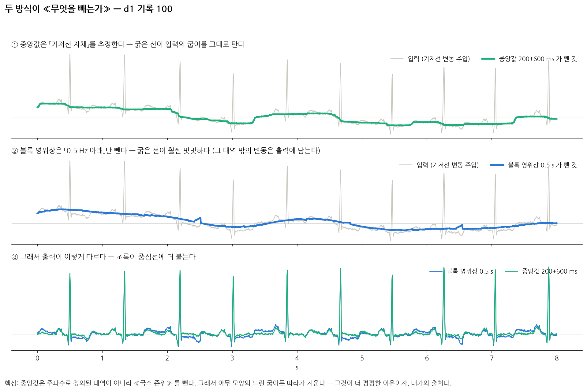
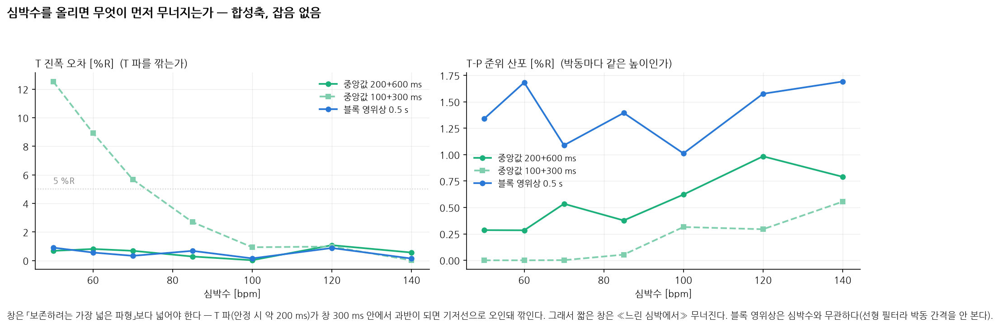
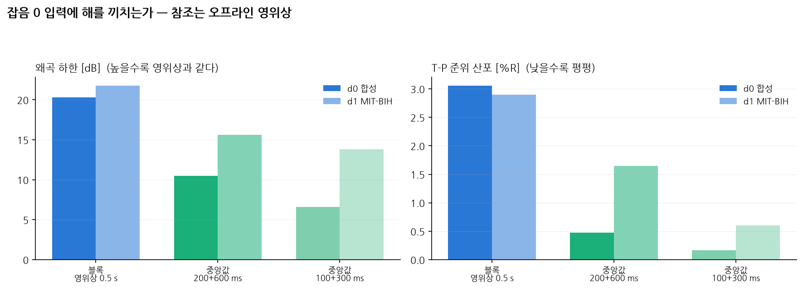

# 14. 중앙값 캐스케이드 vs 블록 영위상 — 무엇이 다른가

> 이 문서는 `scripts/compare_median_vs_zerophase.py` 가 만든다. **직접 고치지 말 것.**
> 후보 전체 표는 `docs/13_lookahead_fe.md`.

## 한 줄

**블록 영위상은 «어떤 주파수 대역» 을 빼고, 중앙값은 «국소 준위가 얼마인가» 를 빼다.**
전자는 선형 필터이고 후자는 비선형 추정기다. 그래서 중앙값이 더 평평하고,
그 능력의 대가가 **심박수**와 **중첩**에 걸려 있다.

## 중앙값 캐스케이드는 무엇을 하는가

```
기저선 추정 = 이동중앙값( 이동중앙값( x, 창 200 ms ), 창 600 ms )
출력        = x − 기저선 추정
```

「이동중앙값(창 w)」은 각 표본에서 **주변 w 안의 표본을 크기순으로 줄 세워 가운데 값**을
고르는 것이다. 평균과 달리 **큰 값 몇 개가 결과를 못 끌어당긴다.**

**왜 QRS 가 안 깎이나.** 창 200 ms 안에서 QRS(약 80 ms)는 절반이 안 된다.
중앙값은 정의상 **과반이 결정**하므로 QRS 는 중앙값이 될 수 없다 —
추정된 기저선에 QRS 가 안 들어가고, 그래서 빼도 QRS 가 안 상한다.

**왜 더 평평한가.** 고역통과는 «0.5 Hz 아래» 라는 **주파수로 정의된 대역**만
지우므로 그 대역 밖의 기저선 변동은 출력에 남는다. 중앙값이 추정하는 것은
대역이 아니라 **국소 준위**여서 **아무 모양의 느린 굽이든 따라가 지운다.**
화면에서 «원본은 중심선을 벗어났는데 통과시킨 것은 딱 붙는» 인상이 이것이다.

**그리고 같은 논리가 위험을 정한다.** 창 안에서 **어떤 파형이 과반을 차지하면**
그것은 기저선으로 오인되어 깎인다. 그러므로 규칙은 하나다 —
**창은 「보존하려는 가장 넓은 파형」보다 넓어야 한다.** T 파는 안정 시 약 200 ms 이므로
창 300 ms 는 위험하고 600 ms 는 안전하다.

## 대가 (1) — 심박수 `[측정]`

> **여기서 예측을 틀렸다.** 처음에는 "창 600 ms 에 T 파가 들어앉으려면 RR 이
> 짧아야 하니 **심박수가 올라가면** 위험하다" 고 적었다. 재보니 **정반대**다 —
> `100+300` 의 T 오차가 50 bpm 12.5 %R 에서 140 bpm 0.0 %R 로 **빠를수록 좋아진다.**
> 심박이 빠르면 T 파가 짧아지고(QT 단축) 창 하나에 여러 박동이 들어와 T 가 과반이
> 될 수 없기 때문이다. **RR 이 아니라 「파형 폭 : 창 길이」 비**가 결정한다.

합성축, 잡음 없음. 영위상 대비 오차다.

| 심박수 | RR | 중앙값 200+600 T 오차 | 중앙값 100+300 T 오차 | 블록 영위상 T 오차 |
|---:|---:|---:|---:|---:|
| 50 bpm | 1200 ms | **0.7 %R** | 12.5 %R | 0.9 %R |
| 60 bpm | 1000 ms | **0.8 %R** | 8.9 %R | 0.6 %R |
| 70 bpm | 857 ms | **0.7 %R** | 5.7 %R | 0.3 %R |
| 85 bpm | 706 ms | **0.3 %R** | 2.7 %R | 0.7 %R |
| 100 bpm | 600 ms | **0.0 %R** | 0.9 %R | 0.2 %R |
| 120 bpm | 500 ms | **1.1 %R** | 1.0 %R | 0.9 %R |
| 140 bpm | 429 ms | **0.6 %R** | 0.0 %R | 0.1 %R |

**블록 영위상은 심박수와 무관하다** — 선형 필터라 박동 간격을 안 본다.
**중앙값 200+600 도 이 범위 전체에서 안전하다**(T 오차 ≤ 1.1 %R).
위험한 것은 창이 짧을 때이고, 그것도 **느린 심박에서** 나타난다.

## 대가 (2) — 중첩이 깨진다 `[측정]`

선형 필터는 `FE(신호+잡음) = FE(신호) + FE(잡음)` 이다. 중앙값은 아니다.
우리 평가는 참조를 `FE(clean)` 으로 두고 `출력 − 참조` 를 오차로 센다(D-3).
그 정의는 **front-end 가 신호와 잡음을 같은 방식으로 다룬다** 는 가정 위에 있다.

`FE(x+n) − FE(x)` 와 `FE(n)` 의 차 (선형이면 0):

| 축 | 방식 | 남은 차 [dB] | p99 [%R] |
|---|---|---:|---:|
| d0 | 블록 영위상 0.5 s | -257.7 | 0.00 |
| d0 | 중앙값 200+600 ms | -17.6 | 6.51 |
| d1 | 블록 영위상 0.5 s | -256.1 | 0.00 |
| d1 | 중앙값 200+600 ms | -22.5 | 3.00 |

## 대가 (3) — 잡음 0 입력 `[측정]`

| 축 | 방식 | 왜곡 하한 [dB] | T 오차 | S 오차 | 준위 산포 | *구간내 잡음* |
|---|---|---:|---:|---:|---:|---:|
| d0 | 블록 영위상 0.5 s | **20.3** | 0.2 %R | 0.5 %R | **3.1 %R** | *5.4 %R* |
| d0 | 중앙값 200+600 ms | **10.5** | 1.5 %R | 1.4 %R | **0.5 %R** | *0.8 %R* |
| d0 | 중앙값 100+300 ms | **6.6** | 16.4 %R | 1.9 %R | **0.2 %R** | *0.5 %R* |
| d1 | 블록 영위상 0.5 s | **21.8** | 0.7 %R | 0.0 %R | **2.9 %R** | *6.6 %R* |
| d1 | 중앙값 200+600 ms | **15.6** | 0.6 %R | 4.5 %R | **1.6 %R** | *6.4 %R* |
| d1 | 중앙값 100+300 ms | **13.8** | 0.9 %R | 5.4 %R | **0.6 %R** | *6.9 %R* |

## 그림





