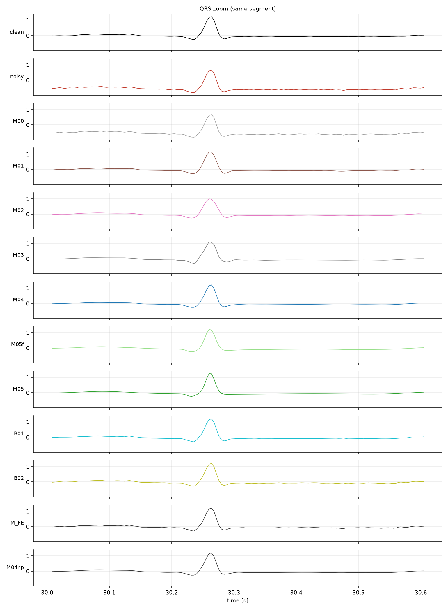
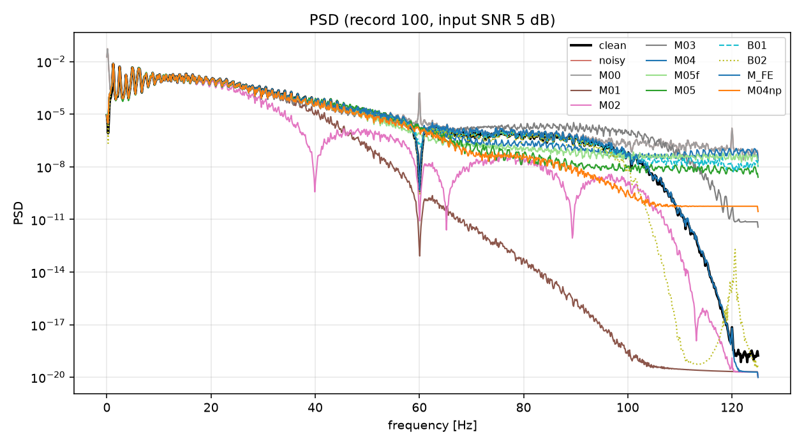
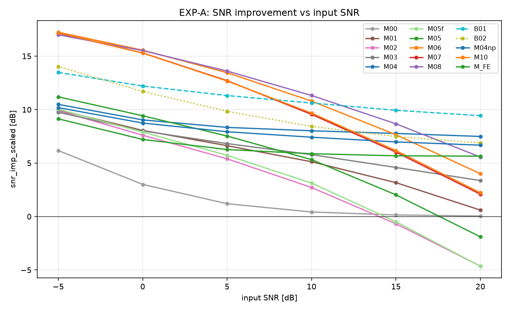
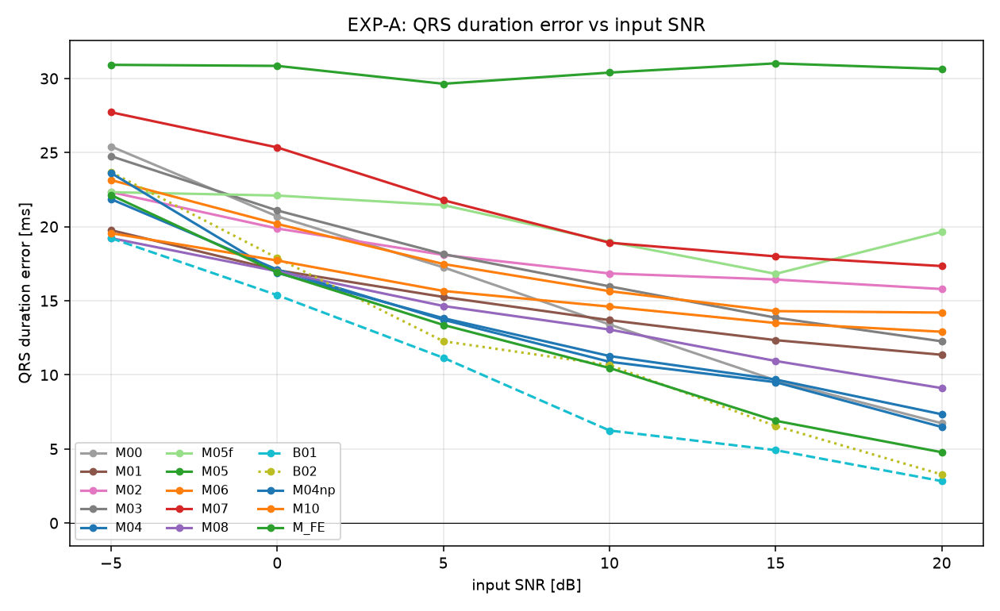
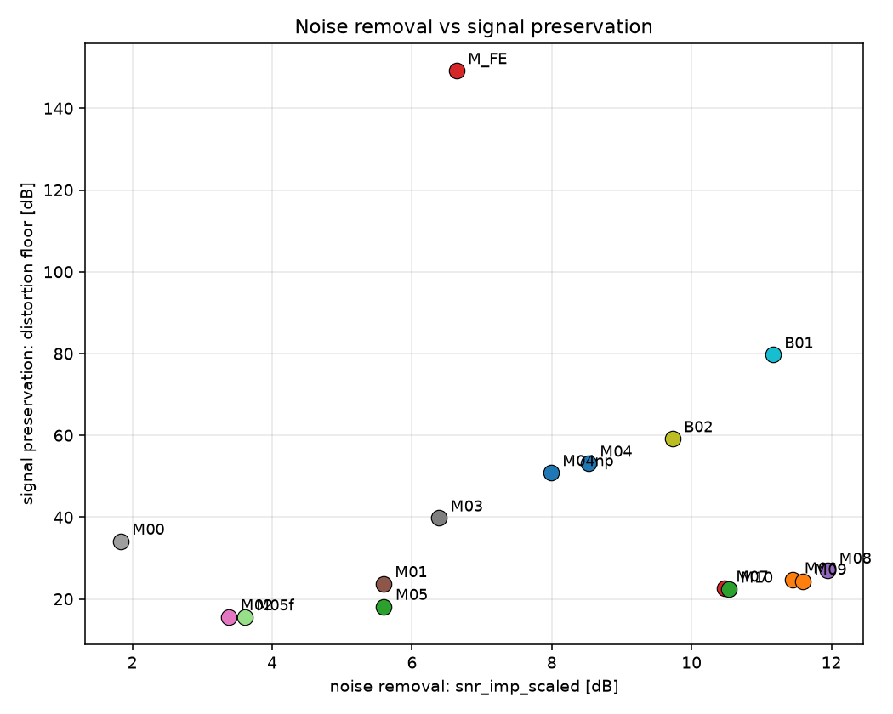
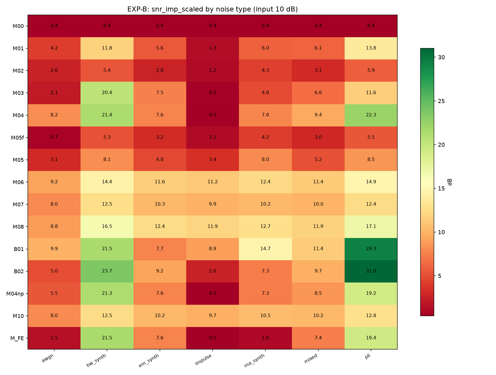
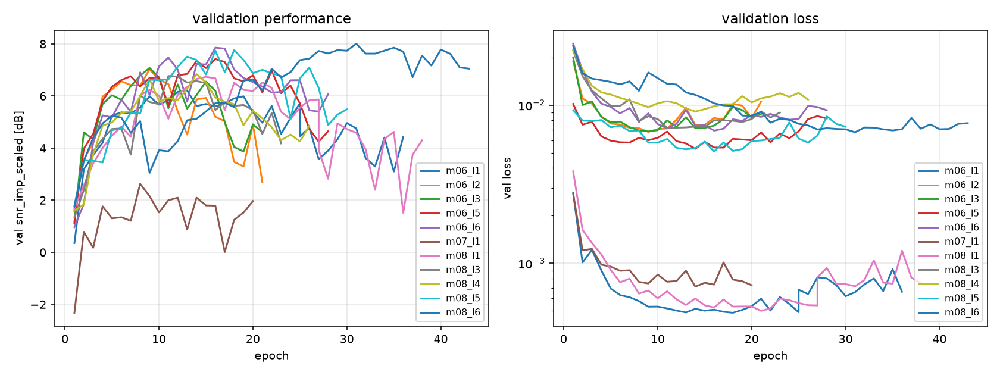

# 90. 실험 결과 (D0)

> 자동 생성: `python scripts/make_report.py --source synthetic`  (수정하지 말 것 — 스크립트를 고칠 것)

> **데이터축: D0 — 합성 ECG (McSharry ODE)**

## 대표 파형

기록 `100`, 입력 SNR 5 dB, 동일 y축.

### QRS 확대

### 주파수 스펙트럼

PSD 는 시간영역에서 보이지 않는 것을 보여준다: 어떤 방법이 60 Hz 를 지웠는지, 어떤 방법이 QRS 의 고주파 성분까지 함께 잘라냈는지.

## 비교 대상

| ID | 분류 | 설명 |
|---|---|---|
| `M00` | baseline | Identity (no-op) |
| `M01` | classical | Bandpass 0.5-40 Hz + auto notch |
| `M02` | classical | Savitzky-Golay (40 ms, order 3) |
| `M03` | timefreq | DWT soft threshold (sym4, L5) |
| `M04` | timefreq | SWT adaptive threshold (level-k + QRS protect, garrote) |
| `M05f` | model | Sameni EKF (forward only) |
| `M05` | model | Sameni EKS (EKF + RTS smoother) |
| `B01` | oracle | Oracle wavelet threshold (wavelet thresholding 계열의 상한) |
| `B02` | oracle | Oracle Wiener (LTI 계열의 상한) |

## EXP-A — 입력 SNR sweep (RQ1)

평가 구간 22 기록 × 168 조건, 집계 단위는 **record**.

### T1. 주 지표 (mean ± std, record 단위)

| method | SNR improvement [dB] ↑ | RMSE [mV] ↓ | Pearson CC ↑ | R-peak Se ↑ | R-peak PPV ↑ | R-peak MAE [ms] ↓ | QRS duration error [ms] ↓ |
|---|---|---|---|---|---|---|---|
| `M00` | 1.82 ± 0.07 | 0.1016 ± 0.0161 | 0.8349 ± 0.0049 | 0.99 ± 0.02 | 0.98 ± 0.02 | 8.69 ± 5.90 | 15.53 ± 15.38 |
| `M01` | 5.40 ± 2.47 | 0.0539 ± 0.0148 | 0.9257 ± 0.0292 | 0.99 ± 0.02 | 0.98 ± 0.02 | 8.70 ± 5.90 | 14.90 ± 13.57 |
| `M02` | 3.25 ± 2.76 | 0.0587 ± 0.0183 | 0.9164 ± 0.0406 | 0.99 ± 0.02 | 0.98 ± 0.02 | 8.69 ± 5.88 | 18.21 ± 13.00 |
| `M03` | 6.12 ± 2.71 | 0.0522 ± 0.0143 | 0.9227 ± 0.0292 | 0.99 ± 0.02 | 0.98 ± 0.02 | 8.80 ± 5.90 | 17.67 ± 12.88 |
| `M04` | 8.04 ± 2.72 | 0.0483 ± 0.0145 | 0.9319 ± 0.0255 | 0.99 ± 0.02 | 0.98 ± 0.02 | 8.73 ± 5.91 | 13.23 ± 11.81 |
| `M05f` | 3.50 ± 2.13 | 0.0563 ± 0.0138 | 0.9198 ± 0.0366 | 0.98 ± 0.02 | 0.98 ± 0.02 | 9.33 ± 6.18 | 20.16 ± 13.85 |
| `M05` | 5.47 ± 2.47 | 0.0473 ± 0.0145 | 0.9371 ± 0.0343 | 0.99 ± 0.02 | 0.98 ± 0.02 | 8.81 ± 5.85 | 30.56 ± 24.97 |
| `M06` | 11.43 ± 3.82 | 0.0240 ± 0.0133 | 0.9780 ± 0.0312 | 0.99 ± 0.03 | 1.00 ± 0.01 | 8.56 ± 5.80 | 17.48 ± 15.61 |
| `M07` | 10.46 ± 3.49 | 0.0246 ± 0.0133 | 0.9798 ± 0.0337 | 0.99 ± 0.02 | 1.00 ± 0.01 | 8.61 ± 5.82 | 21.52 ± 17.05 |
| `M08` | 11.97 ± 3.79 | 0.0233 ± 0.0122 | 0.9790 ± 0.0264 | 0.99 ± 0.04 | 0.99 ± 0.02 | 8.61 ± 5.85 | 13.97 ± 14.10 |
| `B01` | 10.48 ± 3.30 | 0.0340 ± 0.0151 | 0.9594 ± 0.0279 | 0.99 ± 0.01 | 1.00 ± 0.00 | 8.62 ± 5.85 | 9.91 ± 9.82 |
| `B02` | 9.11 ± 3.36 | 0.0331 ± 0.0094 | 0.9597 ± 0.0191 | 0.99 ± 0.02 | 0.98 ± 0.02 | 8.68 ± 5.86 | 12.38 ± 10.74 |
| `M04np` | 7.58 ± 2.75 | 0.0490 ± 0.0145 | 0.9297 ± 0.0276 | 0.99 ± 0.02 | 0.98 ± 0.02 | 8.73 ± 5.89 | 13.74 ± 12.41 |
| `M_FE` | 6.24 ± 3.03 | 0.0618 ± 0.0172 | 0.9080 ± 0.0315 | 0.99 ± 0.02 | 0.98 ± 0.02 | 8.69 ± 5.90 | 12.43 ± 14.14 |

`*` 표시는 `docs/03_metric_floor.md` 의 지표 분해능(floor p95)보다 작은 값 = **구분 불가**.

### T1b. 보조 지표

| method | SNR imp. (no gain corr.) [dB] ↑ | gain bias α* →1 | PRDN [%] ↓ | R amplitude error [%] ↓ | beat template CC ↑ | HR error [bpm] ↓ | R-peak bias [ms] →0 | PSD log-distance [dB] ↓ | RTF (latency / signal) ↓ |
|---|---|---|---|---|---|---|---|---|---|
| `M00` | -0.00 ± 0.00 | 0.7293 ± 0.0071 | 65.26 ± 1.87 | 10.86 ± 3.94 | 0.9955 ± 0.0038 | 0.62 ± 1.38 | 1.26 ± 9.87 | 7.02 ± 6.05 | 0.0000 ± 0.0000 |
| `M01` | 4.78 ± 2.56 | 0.8893 ± 0.0430 | 34.80 ± 8.90 | 12.66 ± 9.82 | 0.9898 ± 0.0146 | 0.62 ± 1.38 | 1.26 ± 9.87 | 21.29 ± 3.64 | 0.0001 ± 0.0000 |
| `M02` | 2.77 ± 2.81 | 0.9264 ± 0.0524 | 37.82 ± 10.57 | 26.18 ± 14.20 | 0.9697 ± 0.0323 | 0.35 ± 0.30 | 1.22 ± 9.85 | 10.90 ± 2.04 | 0.0002 ± 0.0000 |
| `M03` | 5.59 ± 2.80 | 0.9174 ± 0.0522 | 33.71 ± 8.63 | 12.65 ± 8.59 | 0.9904 ± 0.0107 | 0.30 ± 0.26 | 1.28 ± 9.91 | 6.06 ± 2.96 * | 0.0002 ± 0.0000 |
| `M04` | 7.45 ± 2.89 | 0.8938 ± 0.0422 | 31.23 ± 8.50 | 6.09 ± 3.54 | 0.9964 ± 0.0035 | 0.31 ± 0.27 | 1.26 ± 9.91 | 4.39 ± 3.04 * | 0.0012 ± 0.0000 |
| `M05f` | 3.07 ± 2.24 | 0.9253 ± 0.0458 | 36.53 ± 9.41 | 8.85 ± 4.88 | 0.9923 ± 0.0070 | 0.52 ± 1.00 | 2.16 ± 10.04 | 4.08 ± 2.72 * | 0.0240 ± 0.0028 |
| `M05` | 4.98 ± 2.61 | 0.9636 ± 0.0520 | 30.68 ± 9.54 | 10.92 ± 5.90 | 0.9940 ± 0.0062 | 0.61 ± 1.39 | 1.11 ± 9.92 | 3.80 ± 1.67 * | 0.0310 ± 0.0028 |
| `M06` | 11.27 ± 3.85 | 0.9810 ± 0.0248 | 15.58 ± 9.16 | 7.75 ± 13.66 | 0.9923 ± 0.0205 | 0.21 ± 0.26 | 1.26 ± 9.87 | 3.65 ± 2.35 * | 0.0016 ± 0.0001 |
| `M07` | 10.29 ± 3.53 | 0.9996 ± 0.0386 | 15.93 ± 9.48 | 8.59 ± 11.69 | 0.9905 ± 0.0217 | 0.22 ± 0.35 | 1.32 ± 9.97 | 3.54 ± 2.09 * | 0.0027 ± 0.0001 |
| `M08` | 11.82 ± 3.83 | 0.9878 ± 0.0236 | 15.10 ± 8.35 | 6.16 ± 11.80 | 0.9945 ± 0.0132 | 0.26 ± 0.39 | 1.29 ± 9.96 | 3.84 ± 2.30 * | 0.0019 ± 0.0001 |
| `B01` | 10.14 ± 3.53 | 0.9329 ± 0.0477 | 22.07 ± 9.47 | 4.18 ± 1.78 | 0.9979 ± 0.0031 | 0.18 ± 0.23 | 1.31 ± 9.98 | 1.84 ± 1.63 * | 0.0004 ± 0.0000 |
| `B02` | 9.11 ± 3.36 | 1.0024 ± 0.0070 | 21.37 ± 5.77 | 12.06 ± 5.18 | 0.9890 ± 0.0049 | 0.31 ± 0.27 | 1.24 ± 9.85 | 6.92 ± 5.21 | 0.0003 ± 0.0000 |
| `M04np` | 7.01 ± 2.90 | 0.9024 ± 0.0465 | 31.70 ± 8.76 | 9.45 ± 6.96 | 0.9932 ± 0.0077 | 0.31 ± 0.27 | 1.27 ± 9.92 | 5.33 ± 3.13 * | 0.0003 ± 0.0000 |
| `M_FE` | 5.30 ± 3.32 | 0.8422 ± 0.0508 | 40.00 ± 10.98 | 5.30 ± 2.57 | 0.9968 ± 0.0032 | 0.62 ± 1.38 | 1.25 ± 9.87 | 6.88 ± 5.89 | 0.0001 ± 0.0000 |

### T2. 통계 검정 (baseline = `M01`, paired Wilcoxon + Holm)

| metric | method | Δmean | p | p(Holm) | effect r |
|---|---|---|---|---|---|
| `snr_imp_scaled` | `M08` | +6.573 | 4.77e-07 | 6.20e-06 | +1.000 |
| `snr_imp_scaled` | `M06` | +6.033 | 9.54e-07 | 8.58e-06 | +0.992 |
| `snr_imp_scaled` | `B01` | +5.082 | 4.77e-07 | 6.20e-06 | +1.000 |
| `snr_imp_scaled` | `M07` | +5.060 | 9.54e-07 | 8.58e-06 | +0.992 |
| `snr_imp_scaled` | `B02` | +3.715 | 4.77e-07 | 6.20e-06 | +1.000 |
| `snr_imp_scaled` | `M04` | +2.648 | 4.77e-07 | 6.20e-06 | +1.000 |
| `snr_imp_scaled` | `M04np` | +2.183 | 9.54e-07 | 8.58e-06 | +0.992 |
| `snr_imp_scaled` | `M_FE` | +0.849 | 3.53e-01 | 8.27e-01 | +0.233 |
| `snr_imp_scaled` | `M03` | +0.726 | 2.76e-01 | 8.27e-01 | +0.273 |
| `snr_imp_scaled` | `M05` | +0.074 | 7.75e-01 | 8.27e-01 | -0.075 |
| `snr_imp_scaled` | `M05f` | -1.894 | 6.94e-04 | 2.78e-03 | -0.779 |
| `snr_imp_scaled` | `M02` | -2.143 | 3.34e-06 | 2.00e-05 | -0.968 |
| `snr_imp_scaled` | `M00` | -3.571 | 1.19e-05 | 5.96e-05 | -0.937 |
| `qrs_dur_err_ms` | `M05` | +15.664 | 3.84e-02 | 5.00e-01 | +0.515 |
| `qrs_dur_err_ms` | `M07` | +6.626 | 6.46e-02 | 7.76e-01 | +0.463 |
| `qrs_dur_err_ms` | `M05f` | +5.269 | 2.16e-01 | 1.00e+00 | +0.316 |
| `qrs_dur_err_ms` | `M02` | +3.314 | 1.37e-01 | 1.00e+00 | +0.377 |
| `qrs_dur_err_ms` | `M03` | +2.777 | 1.91e-01 | 1.00e+00 | +0.333 |
| `qrs_dur_err_ms` | `M06` | +2.582 | 3.93e-01 | 1.00e+00 | +0.221 |
| `qrs_dur_err_ms` | `M00` | +0.629 | 9.19e-01 | 1.00e+00 | +0.030 |
| `qrs_dur_err_ms` | `M08` | -0.922 | 7.33e-01 | 1.00e+00 | -0.091 |
| `qrs_dur_err_ms` | `M04np` | -1.157 | 7.08e-01 | 1.00e+00 | +0.100 |
| `qrs_dur_err_ms` | `M04` | -1.669 | 8.92e-01 | 1.00e+00 | +0.039 |
| `qrs_dur_err_ms` | `M_FE` | -2.466 | 2.72e-01 | 1.00e+00 | -0.281 |
| `qrs_dur_err_ms` | `B02` | -2.516 | 6.09e-01 | 1.00e+00 | -0.134 |
| `qrs_dur_err_ms` | `B01` | -4.982 | 8.22e-02 | 9.04e-01 | -0.437 |

#### T2b. SNR 구간별 검정 (`snr_imp_scaled`, baseline = `M01`)

전체 평균 검정은 SNR 교차를 지운다. 구간별로 다시 본다. `✓` = Holm 보정 후 p < 0.05.

| 입력 SNR | 유의하게 우수 | 유의하게 열등 |
|---|---|---|
| -5 dB | `M06`, `M07`, `M08`, `B02`, `B01`, `M04` | `M00` |
| 0 dB | `M06`, `M08`, `M07`, `B01`, `B02`, `M05`, `M04`, `M04np` | `M00` |
| 5 dB | `M08`, `M06`, `M07`, `B01`, `B02`, `M04`, `M04np` | `M02`, `M00` |
| 10 dB | `M08`, `M06`, `B01`, `M07`, `B02`, `M04`, `M04np` | `M05f`, `M02`, `M00` |
| 15 dB | `B01`, `M08`, `M06`, `M04`, `B02`, `M04np`, `M07` | `M00`, `M05f`, `M02` |
| 20 dB | `B01`, `M04`, `M08`, `B02`, `M04np`, `M_FE`, `M06` | `M05`, `M05f`, `M02` |

## EXP-C — distortion floor (RQ3)

**잡음이 전혀 없는 clean 신호**를 각 방법에 그대로 통과시켰을 때의 출력 SNR.
낮을수록 그 방법은 '잡음이 없어도 신호를 망가뜨린다'. 출력 SNR 은 원리적으로 이 값을 넘을 수 없으므로 **성능의 천장**이기도 하다.

| method | distortion floor [dB] ↑ |
|---|---|
| `M00` | ∞ (identity) |
| `M01` | 22.23 |
| `M02` | 15.39 |
| `M03` | 32.33 |
| `M04` | 34.09 |
| `M05f` | 15.48 |
| `M05` | 18.00 |
| `M06` | 24.88 |
| `M07` | 22.69 |
| `M08` | 27.42 |
| `B01` | 34.13 |
| `B02` | 34.13 |
| `M04np` | 34.00 |
| `M_FE` | 34.13 |

오른쪽 위로 갈수록 좋다. 오른쪽 아래는 '잡음은 잘 지우지만 파형을 망가뜨리는' 방법이다.

## EXP-D — wavelet 을 어디에 쓸 것인가 (RQ4)

같은 backbone(Residual U-Net)·같은 손실·같은 데이터에서 **wavelet 의 위치만** 바꾼다.

| ID | wavelet 의 역할 |
|---|---|
| `M06` | 쓰지 않음 (raw 파형을 그대로 입력) |
| `M07` | **전처리 필터** — SWT thresholding 으로 1차 제거한 뒤 U-Net |
| `M08` | **입력 표현공간** — SWT subband 를 채널로 주고 U-Net 이 대역별 잡음을 학습 |

| metric | M06 | M07 | M08 |
|---|---|---|---|
| `snr_imp_scaled` | 11.43 | 10.46 | 11.97 |
| `rmse` | 0.02403 | 0.02457 | 0.0233 |
| `cc` | 0.978 | 0.9798 | 0.979 |
| `se` | 0.9873 | 0.9888 | 0.9854 |
| `ppv` | 0.9957 | 0.9976 | 0.9935 |
| `rpeak_mae_ms` | 8.557 | 8.611 | 8.605 |
| `qrs_dur_err_ms` | 17.48 | 21.52 | 13.97 |

이 표가 답하는 것: **DSP 를 AI 앞단에 두는 것**과 **DSP 가 정의한 표현공간을 AI 에게 주는 것** 중 무엇이 효과적인가.
차이가 크지 않다면 그것도 결과다 — 'wavelet 표현이 U-Net 이 스스로 배우는 것 이상을 주지 못한다'.

## EXP-B — 잡음 종류별 강약 (RQ2)

| method | awgn | bw_synth | em_synth | impulse | ma_synth | mixed | pli |
|---|---|---|---|---|---|---|---|
| `M00` | 0.42 | 0.40 | 0.42 | 0.41 | 0.41 | 0.42 | 0.41 |
| `M01` | 4.06 | 11.12 | 5.46 | 1.25 | 5.85 | 5.93 | 12.25 |
| `M02` | 2.53 | 5.18 | 2.68 | 1.09 | 4.18 | 3.04 | 5.59 |
| `M03` | 2.05 | 18.52 | 7.38 | 0.48 | 4.73 | 6.32 | 11.18 |
| `M04` | 8.00 | 19.13 | 7.44 | 0.45 | 7.62 | 8.99 | 19.55 |
| `M05f` | 0.62 | 5.20 | 3.16 | 1.16 | 4.13 | 2.89 | 5.39 |
| `M05` | 3.03 | 7.94 | 4.73 | 3.34 | 7.82 | 5.08 | 8.31 |
| `M06` | 9.17 | 14.57 | 11.70 | 11.24 | 12.42 | 11.44 | 15.06 |
| `M07` | 8.02 | 12.60 | 10.38 | 9.91 | 10.26 | 10.06 | 12.45 |
| `M08` | 8.88 | 16.78 | 12.56 | 11.98 | 12.78 | 12.02 | 17.46 |
| `B01` | 9.67 | 19.13 | 7.51 | 8.66 | 13.92 | 10.68 | 22.38 |
| `B02` | 4.84 | 20.05 | 8.90 | 2.51 | 7.12 | 9.07 | 21.72 |
| `M04np` | 5.33 | 19.10 | 7.44 | 0.45 | 7.11 | 8.09 | 17.42 |
| `M_FE` | 1.43 | 19.13 | 7.44 | 0.45 | 0.96 | 6.96 | 17.76 |

## 학습 곡선

| run | best epoch | best val snr_imp_scaled [dB] |
|---|---|---|
| `m06_l1` | 13 | 6.21 |
| `m06_l2` | 9 | 7.03 |
| `m06_l3` | 9 | 7.08 |
| `m07_l1` | 8 | 2.63 |
| `m08_l1` | 15 | 6.74 |
| `m08_l3` | 11 | 6.77 |
| `m08_l4` | 14 | 6.84 |

### T3. 계산 비용

| method | RTF (latency / signal duration) |
|---|---|
| `M00` | 0.0000 |
| `M01` | 0.0001 |
| `M02` | 0.0002 |
| `M03` | 0.0002 |
| `M04` | 0.0012 |
| `M05f` | 0.0240 |
| `M05` | 0.0310 |
| `M06` | 0.0016 |
| `M07` | 0.0027 |
| `M08` | 0.0019 |
| `B01` | 0.0004 |
| `B02` | 0.0003 |
| `M04np` | 0.0003 |
| `M_FE` | 0.0001 |

RTF < 1 이면 실시간 처리 가능. (단일 CPU 스레드, 60 s 구간 기준)

## 결론 (표에서 직접 도출)

### 1) 입력 SNR 구간별 최적 기법 (RQ1)

| 입력 SNR [dB] | 최적(실용) | 그 값 | 2위 | oracle `B01` 대비 부족분 |
|---|---|---|---|---|
| -5 | **`M06`** | +17.25 dB | `M07` (+17.17) | -3.83 dB |
| 0 | **`M06`** | +15.57 dB | `M08` (+15.55) | -3.50 dB |
| 5 | **`M08`** | +13.65 dB | `M06` (+13.46) | -2.59 dB |
| 10 | **`M08`** | +11.37 dB | `M06` (+10.80) | -1.26 dB |
| 15 | **`M08`** | +8.71 dB | `M06` (+7.63) | +0.20 dB |
| 20 | **`M04`** | +5.86 dB | `M08` (+5.51) | +1.44 dB |

### 2) 오히려 신호를 나쁘게 만드는 구간

아래 조건에서는 **아무 처리도 하지 않는 편이 낫다** (`snr_imp_scaled < 0`):

- `M01` (입력 20 dB)
- `M02` (입력 15, 20 dB)
- `M05f` (입력 15, 20 dB)
- `M05` (입력 20 dB)

### 3) 잡음 제거 vs 신호 보존의 Pareto front (RQ3)

가로축 = 잡음을 얼마나 제거했는가, 세로축 = 깨끗한 신호를 얼마나 안 망가뜨리는가.

- **Pareto front (실용 기법)**: `M04`, `M08`
- **지배당함 (두 축 모두에서 더 나은 대안이 있음)**: `M01`, `M02`, `M03`, `M05f`, `M05`, `M06`, `M07`

> `distortion floor` 는 출력 SNR 의 **천장**이기도 하다. 예를 들어 floor 가 15 dB 인 방법은 입력이 아무리 깨끗해도 출력이 15 dB 를 넘지 못한다.

### 4) 이 실험에서 판별력이 없었던 지표

- `rpeak_mae_ms` 는 무처리(`M00`)에서도 8.69 ms 다. 이는 방법의 성능이 아니라 **검출기(xqrs)의 체계적 위치 편향**이며 모든 방법에 공통이다. 방법 간 편차는 0.77 ms 로 좁아 이 조건에서는 판별력이 없다. MIT-BIH 처럼 형태 변이가 큰 데이터에서 다시 볼 것.

### 5) 잡음 종류에 따라 답이 갈린다 (RQ2)

입력 10 dB 고정. **잡음 종류마다 최적 기법이 다르다** — 단일 승자는 없다.

| 잡음 | 최적(실용) | 그 값 | 최악(실용) | 그 값 |
|---|---|---|---|---|
| `awgn` | **`M06`** | +9.17 dB | `M05f` | +0.62 dB |
| `bw_synth` | **`M04`** | +19.13 dB | `M02` | +5.18 dB |
| `em_synth` | **`M08`** | +12.56 dB | `M02` | +2.68 dB |
| `impulse` | **`M08`** | +11.98 dB | `M04` | +0.45 dB |
| `ma_synth` | **`M08`** | +12.78 dB | `M05f` | +4.13 dB |
| `mixed` | **`M08`** | +12.02 dB | `M05f` | +2.89 dB |
| `pli` | **`M04`** | +19.55 dB | `M05f` | +5.39 dB |

> **가장 실용적인 발견**: 순간적인 임펄스성 artifact (오실로스코프에서 보이는 날카로운 spike) 에서는 딥러닝 계열이 +12.0 dB, 고전 DSP 계열이 최대 +1.2 dB 다.
> 임펄스는 시간축에서 sparse 하고 광대역이라 **주파수 기반 분리가 원리적으로 통하지 않는다.** 반대로 PLI·baseline wander 에서는 튜닝된 SWT 가 oracle 에 근접하고 딥러닝이 오히려 뒤진다.

### 6) 이 결과의 적용 범위

- **합성 ECG(D0) 기준이다.** MIT-BIH(D1) 로 반드시 재검증해야 한다 (`docs/02_procedure.md` STEP 14-15).
- 딥러닝은 이 합성 분포에서 학습했다. 다른 morphology 분포에서 얼마나 유지되는지는 별도 검증 대상이다 (F-8 참조).
- 실측 Arduino 신호의 SNR 을 추정한 뒤(`STEP 29`), 위 1) 표에서 해당 구간의 행을 보면 **그 장비에 어떤 기법을 써야 하는지** 바로 읽을 수 있다.

