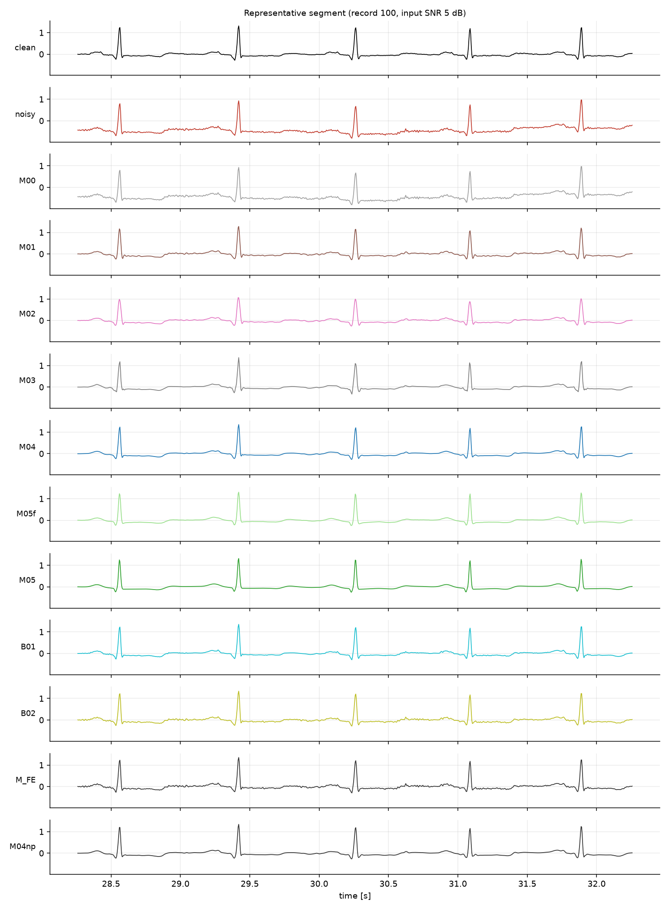
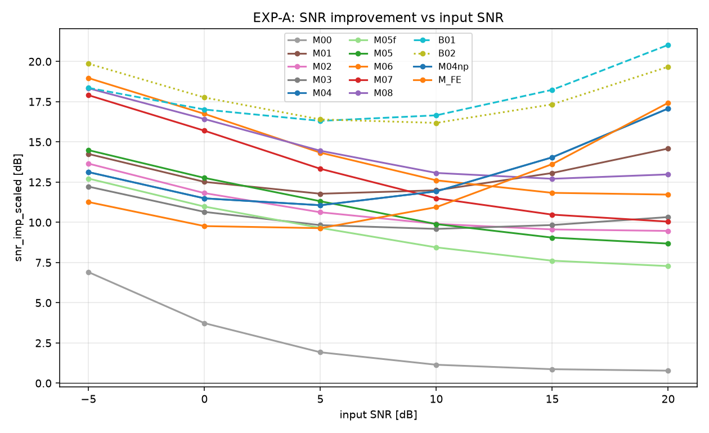
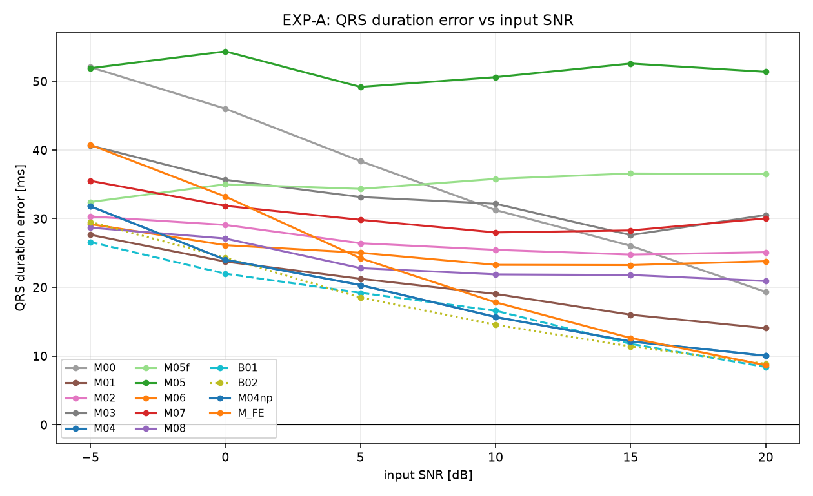
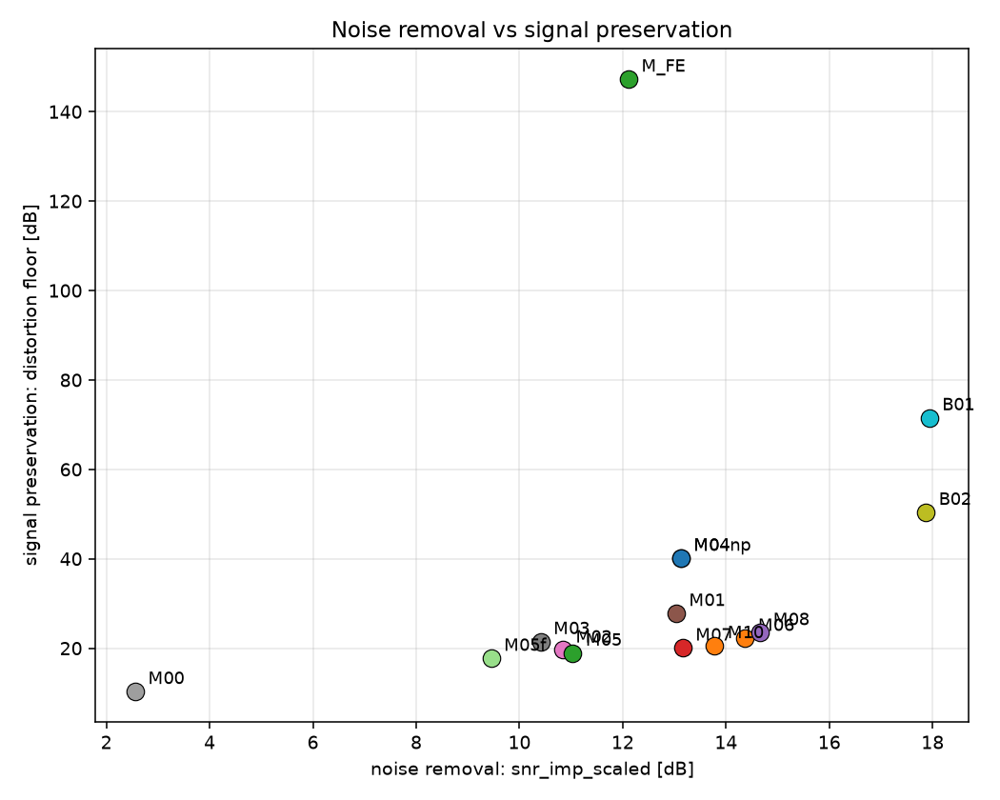
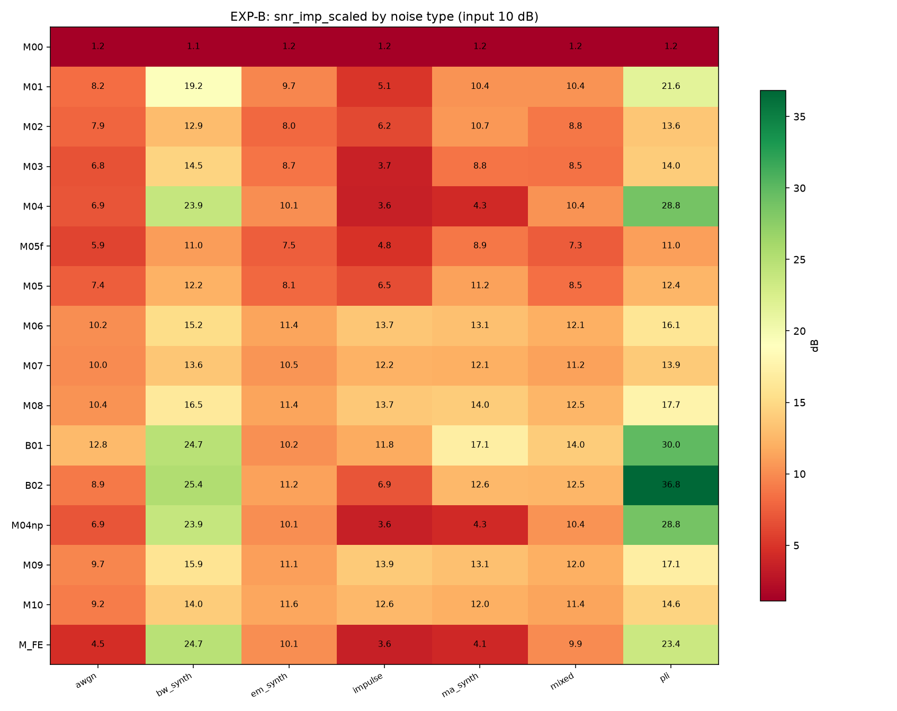
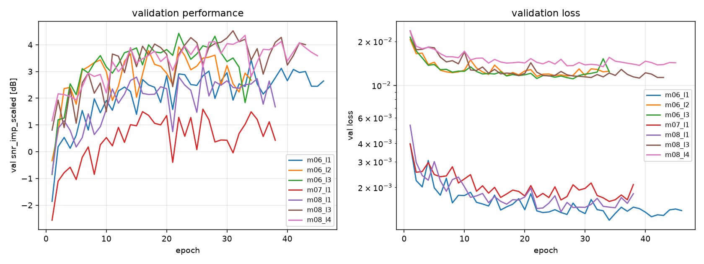

# 90. 실험 결과 (D1)

> 자동 생성: `python scripts/make_report.py --source mitdb`  (수정하지 말 것 — 스크립트를 고칠 것)

> **데이터축: D1 — MIT-BIH + NSTDB 실잡음**

## 대표 파형

기록 `100`, 입력 SNR 5 dB, 동일 y축.

### QRS 확대

### 주파수 스펙트럼

PSD 는 시간영역에서 보이지 않는 것을 보여준다: 어떤 방법이 60 Hz 를 지웠는지, 어떤 방법이 QRS 의 고주파 성분까지 함께 잘라냈는지.

## 비교 대상

| ID | 분류 | 설명 |
|---|---|---|
| `M00` | baseline | Identity (no-op) |
| `M01` | classical | Bandpass 0.5-40 Hz + auto notch |
| `M02` | classical | Savitzky-Golay (40 ms, order 3) |
| `M03` | timefreq | DWT soft threshold (sym4, L5) |
| `M04` | timefreq | SWT adaptive threshold (level-k + QRS protect, garrote) |
| `M05f` | model | Sameni EKF (forward only) |
| `M05` | model | Sameni EKS (EKF + RTS smoother) |
| `B01` | oracle | Oracle wavelet threshold (wavelet thresholding 계열의 상한) |
| `B02` | oracle | Oracle Wiener (LTI 계열의 상한) |

## EXP-A — 입력 SNR sweep (RQ1)

평가 구간 22 기록 × 180 조건, 집계 단위는 **record**.

### T1. 주 지표 (mean ± std, record 단위)

| method | SNR improvement [dB] ↑ | RMSE [mV] ↓ | Pearson CC ↑ | R-peak Se ↑ | R-peak PPV ↑ | R-peak MAE [ms] ↓ | QRS duration error [ms] ↓ |
|---|---|---|---|---|---|---|---|
| `M00` | 2.56 ± 0.83 | 0.2485 ± 0.0984 | 0.7754 ± 0.0611 | 0.99 ± 0.02 | 0.98 ± 0.03 | 2.64 ± 4.31 | 35.50 ± 28.47 |
| `M01` | 13.03 ± 3.76 | 0.0843 ± 0.0548 | 0.9443 ± 0.0218 | 0.99 ± 0.02 | 0.98 ± 0.03 | 2.64 ± 4.31 | 20.28 ± 12.40 * |
| `M02` | 10.84 ± 3.32 | 0.0810 ± 0.0421 | 0.9490 ± 0.0202 | 0.99 ± 0.02 | 0.98 ± 0.03 | 2.69 ± 4.38 | 26.85 ± 11.64 * |
| `M03` | 10.41 ± 2.72 | 0.0899 ± 0.0545 | 0.9374 ± 0.0251 | 0.98 ± 0.02 | 0.98 ± 0.02 | 2.89 ± 4.06 | 33.53 ± 16.96 |
| `M04` | 13.12 ± 5.71 | 0.1150 ± 0.0903 | 0.9150 ± 0.0477 | 0.99 ± 0.02 | 0.98 ± 0.03 | 2.64 ± 4.29 | 18.99 ± 13.99 * |
| `M05f` | 9.45 ± 2.84 | 0.0879 ± 0.0501 | 0.9429 ± 0.0255 | 0.98 ± 0.02 | 0.98 ± 0.02 | 3.09 ± 4.46 | 34.95 ± 18.55 |
| `M05` | 11.03 ± 3.21 | 0.0728 ± 0.0381 | 0.9565 ± 0.0214 | 0.99 ± 0.02 | 0.98 ± 0.02 | 2.78 ± 4.35 | 50.72 ± 24.92 |
| `M06` | 14.37 ± 3.00 | 0.0445 ± 0.0207 | 0.9797 ± 0.0282 | 0.99 ± 0.01 | 1.00 ± 0.01 | 2.45 ± 4.49 | 25.02 ± 13.45 * |
| `M07` | 13.16 ± 2.74 | 0.0506 ± 0.0235 | 0.9778 ± 0.0209 | 0.99 ± 0.02 | 1.00 ± 0.01 | 2.37 ± 4.29 | 31.15 ± 16.64 |
| `M08` | 14.66 ± 3.05 | 0.0447 ± 0.0198 | 0.9795 ± 0.0256 | 0.99 ± 0.02 | 1.00 ± 0.01 | 2.35 ± 4.23 | 24.19 ± 13.62 * |
| `B01` | 17.93 ± 5.04 | 0.0471 ± 0.0289 | 0.9758 ± 0.0165 | 0.99 ± 0.01 | 1.00 ± 0.00 | 2.44 ± 4.21 | 17.98 ± 11.90 * |
| `B02` | 17.87 ± 6.71 | 0.0486 ± 0.0297 | 0.9732 ± 0.0153 | 0.99 ± 0.02 | 0.98 ± 0.03 | 2.73 ± 4.34 | 17.85 ± 11.10 * |
| `M04np` | 13.12 ± 5.71 | 0.1150 ± 0.0903 | 0.9150 ± 0.0477 | 0.99 ± 0.02 | 0.98 ± 0.03 | 2.64 ± 4.29 | 18.99 ± 13.99 * |
| `M10` | 13.78 ± 3.35 | 0.0476 ± 0.0239 | 0.9790 ± 0.0243 | 0.99 ± 0.03 | 1.00 ± 0.01 | 2.55 ± 4.89 | 24.95 ± 14.65 * |
| `M_FE` | 12.11 ± 4.86 | 0.1221 ± 0.0941 | 0.9094 ± 0.0499 | 0.99 ± 0.02 | 0.98 ± 0.03 | 2.64 ± 4.31 | 22.87 ± 16.81 * |

`*` 표시는 `docs/03_metric_floor_d1.md` 의 지표 분해능(floor p95)보다 작은 값 = **구분 불가**.

### T1b. 보조 지표

| method | SNR imp. (no gain corr.) [dB] ↑ | gain bias α* →1 | PRDN [%] ↓ | R amplitude error [%] ↓ | beat template CC ↑ | HR error [bpm] ↓ | R-peak bias [ms] →0 | PSD log-distance [dB] ↓ | RTF (latency / signal) ↓ |
|---|---|---|---|---|---|---|---|---|---|
| `M00` | 0.00 ± 0.00 | 0.6318 ± 0.0946 | 87.03 ± 21.42 | 58.53 ± 61.13 | 0.9935 ± 0.0060 | 1.23 ± 2.12 | -1.24 ± 4.33 | 8.30 ± 6.06 | 0.0000 ± 0.0000 |
| `M01` | 12.52 ± 3.89 | 0.9067 ± 0.0391 | 27.39 ± 8.10 | 5.74 ± 3.20 | 0.9973 ± 0.0020 | 1.23 ± 2.11 | -1.24 ± 4.34 | 22.79 ± 2.58 | 0.0001 ± 0.0000 |
| `M02` | 10.44 ± 3.38 | 0.9479 ± 0.0365 | 27.32 ± 6.87 | 12.73 ± 6.89 | 0.9913 ± 0.0077 | 1.29 ± 2.19 | -1.25 ± 4.38 | 10.44 ± 2.02 | 0.0001 ± 0.0000 |
| `M03` | 9.99 ± 2.84 | 0.9489 ± 0.0476 | 29.77 ± 7.90 | 14.38 ± 10.73 | 0.9920 ± 0.0078 | 0.60 ± 1.21 | -1.11 ± 3.79 | 6.19 ± 2.71 | 0.0001 ± 0.0000 |
| `M04` | 12.24 ± 6.08 | 0.8574 ± 0.0766 | 36.56 ± 17.11 | 6.76 ± 5.25 | 0.9964 ± 0.0044 | 1.22 ± 2.10 | -1.24 ± 4.31 | 7.79 ± 5.79 | 0.0002 ± 0.0000 |
| `M05f` | 9.15 ± 2.96 | 0.9422 ± 0.0344 | 29.58 ± 8.12 | 9.91 ± 9.66 | 0.9900 ± 0.0087 | 1.26 ± 2.16 | -0.15 ± 3.82 | 5.38 ± 2.63 | 0.0175 ± 0.0080 |
| `M05` | 10.71 ± 3.31 | 0.9801 ± 0.0453 | 25.00 ± 7.48 | 10.51 ± 7.75 | 0.9930 ± 0.0056 | 1.18 ± 2.06 | -0.85 ± 3.43 | 6.70 ± 2.97 | 0.0212 ± 0.0076 |
| `M06` | 14.28 ± 3.01 | 1.0099 ± 0.0211 | 16.28 ± 9.37 | 4.94 ± 4.15 | 0.9926 ± 0.0142 | 0.22 ± 0.34 | -1.22 ± 4.52 | 4.24 ± 1.20 | 0.0012 ± 0.0000 |
| `M07` | 13.02 ± 2.72 | 1.0104 ± 0.0409 | 18.02 ± 7.95 | 5.89 ± 4.78 | 0.9916 ± 0.0126 | 0.26 ± 0.47 | -1.34 ± 4.25 | 4.76 ± 1.72 | 0.0019 ± 0.0000 |
| `M08` | 14.50 ± 3.05 | 1.0126 ± 0.0311 | 16.19 ± 8.56 | 4.80 ± 4.37 | 0.9941 ± 0.0120 | 0.24 ± 0.42 | -1.25 ± 4.21 | 4.80 ± 1.26 | 0.0014 ± 0.0000 |
| `B01` | 17.76 ± 5.15 | 0.9623 ± 0.0300 | 15.68 ± 6.63 | 4.29 ± 3.72 | 0.9986 ± 0.0015 | 0.20 ± 0.32 | -1.24 ± 4.17 | 2.69 ± 2.53 | 0.0002 ± 0.0000 |
| `B02` | 17.86 ± 6.70 | 0.9998 ± 0.0044 | 16.09 ± 5.67 | 8.18 ± 4.54 | 0.9933 ± 0.0044 | 1.17 ± 2.02 | -1.21 ± 4.39 | 7.89 ± 6.20 | 0.0002 ± 0.0000 |
| `M04np` | 12.24 ± 6.08 | 0.8574 ± 0.0766 | 36.56 ± 17.11 | 6.76 ± 5.25 | 0.9964 ± 0.0044 | 1.22 ± 2.10 | -1.24 ± 4.31 | 7.79 ± 5.79 | 0.0002 ± 0.0000 |
| `M10` | 13.60 ± 3.40 | 1.0294 ± 0.0373 | 17.27 ± 9.48 | 5.54 ± 5.57 | 0.9907 ± 0.0142 | 0.26 ± 0.47 | -1.42 ± 5.00 | 3.51 ± 1.25 | 0.0039 ± 0.0001 |
| `M_FE` | 11.15 ± 5.26 | 0.8480 ± 0.0793 | 39.09 ± 17.67 | 7.35 ± 5.72 | 0.9961 ± 0.0046 | 1.23 ± 2.12 | -1.24 ± 4.33 | 7.73 ± 6.24 | 0.0001 ± 0.0000 |

### T2. 통계 검정 (baseline = `M01`, paired Wilcoxon + Holm)

| metric | method | Δmean | p | p(Holm) | effect r |
|---|---|---|---|---|---|
| `snr_imp_scaled` | `B01` | +4.903 | 4.77e-07 | 6.68e-06 | +1.000 |
| `snr_imp_scaled` | `B02` | +4.838 | 4.77e-07 | 6.68e-06 | +1.000 |
| `snr_imp_scaled` | `M08` | +1.629 | 3.01e-02 | 2.11e-01 | +0.526 |
| `snr_imp_scaled` | `M06` | +1.338 | 9.84e-02 | 5.90e-01 | +0.407 |
| `snr_imp_scaled` | `M10` | +0.746 | 3.53e-01 | 1.00e+00 | +0.233 |
| `snr_imp_scaled` | `M07` | +0.126 | 7.26e-01 | 1.00e+00 | +0.091 |
| `snr_imp_scaled` | `M04np` | +0.089 | 9.75e-01 | 1.00e+00 | +0.012 |
| `snr_imp_scaled` | `M04` | +0.089 | 9.75e-01 | 1.00e+00 | +0.012 |
| `snr_imp_scaled` | `M_FE` | -0.921 | 1.21e-01 | 6.03e-01 | -0.383 |
| `snr_imp_scaled` | `M05` | -2.001 | 1.56e-02 | 1.25e-01 | -0.581 |
| `snr_imp_scaled` | `M02` | -2.194 | 2.13e-04 | 1.92e-03 | -0.834 |
| `snr_imp_scaled` | `M03` | -2.624 | 4.77e-07 | 6.68e-06 | -1.000 |
| `snr_imp_scaled` | `M05f` | -3.583 | 1.57e-05 | 1.57e-04 | -0.929 |
| `snr_imp_scaled` | `M00` | -10.474 | 4.77e-07 | 6.68e-06 | -1.000 |
| `qrs_dur_err_ms` | `M05` | +30.444 | 3.34e-05 | 4.34e-04 | +0.905 |
| `qrs_dur_err_ms` | `M00` | +15.224 | 6.53e-05 | 7.84e-04 | +0.881 |
| `qrs_dur_err_ms` | `M05f` | +14.674 | 5.04e-04 | 5.04e-03 | +0.794 |
| `qrs_dur_err_ms` | `M03` | +13.258 | 1.43e-06 | 2.00e-05 | +0.984 |
| `qrs_dur_err_ms` | `M07` | +10.875 | 9.87e-05 | 1.09e-03 | +0.866 |
| `qrs_dur_err_ms` | `M02` | +6.572 | 2.50e-03 | 2.00e-02 | +0.708 |
| `qrs_dur_err_ms` | `M06` | +4.747 | 1.45e-03 | 1.31e-02 | +0.739 |
| `qrs_dur_err_ms` | `M10` | +4.675 | 3.59e-02 | 1.81e-01 | +0.510 |
| `qrs_dur_err_ms` | `M08` | +3.912 | 6.65e-03 | 4.65e-02 | +0.644 |
| `qrs_dur_err_ms` | `M_FE` | +2.594 | 3.21e-01 | 9.16e-01 | +0.249 |
| `qrs_dur_err_ms` | `M04` | -1.287 | 3.05e-01 | 9.16e-01 | -0.257 |
| `qrs_dur_err_ms` | `M04np` | -1.287 | 3.05e-01 | 9.16e-01 | -0.257 |
| `qrs_dur_err_ms` | `B01` | -2.294 | 3.01e-02 | 1.81e-01 | -0.526 |
| `qrs_dur_err_ms` | `B02` | -2.428 | 1.87e-01 | 7.48e-01 | -0.328 |

#### T2b. SNR 구간별 검정 (`snr_imp_scaled`, baseline = `M01`)

전체 평균 검정은 SNR 교차를 지운다. 구간별로 다시 본다. `✓` = Holm 보정 후 p < 0.05.

| 입력 SNR | 유의하게 우수 | 유의하게 열등 |
|---|---|---|
| -5 dB | `B02`, `M10`, `M06`, `B01`, `M08`, `M07` | `M04`, `M04np`, `M_FE`, `M00` |
| 0 dB | `B02`, `B01`, `M06`, `M10`, `M08`, `M07` | `M03`, `M_FE`, `M00` |
| 5 dB | `B02`, `B01`, `M08` | `M03`, `M_FE`, `M00` |
| 10 dB | `B01`, `B02` | `M02`, `M03`, `M05f`, `M00` |
| 15 dB | `B01`, `B02` | `M03`, `M02`, `M05`, `M05f`, `M00` |
| 20 dB | `B01`, `B02` | `M10`, `M03`, `M07`, `M02`, `M05`, `M05f`, `M00` |

## EXP-C — distortion floor (RQ3)

**잡음이 전혀 없는 clean 신호**를 각 방법에 그대로 통과시켰을 때의 출력 SNR.
낮을수록 그 방법은 '잡음이 없어도 신호를 망가뜨린다'. 출력 SNR 은 원리적으로 이 값을 넘을 수 없으므로 **성능의 천장**이기도 하다.

| method | distortion floor [dB] ↑ |
|---|---|
| `M00` | 10.35 |
| `M01` | 27.79 |
| `M02` | 19.62 |
| `M03` | 21.50 |
| `M04` | 40.14 |
| `M05f` | 17.76 |
| `M05` | 18.92 |
| `M06` | 22.22 |
| `M07` | 20.07 |
| `M08` | 23.51 |
| `B01` | 71.57 |
| `B02` | 50.41 |
| `M04np` | 40.14 |
| `M10` | 20.59 |
| `M_FE` | 147.29 |

오른쪽 위로 갈수록 좋다. 오른쪽 아래는 '잡음은 잘 지우지만 파형을 망가뜨리는' 방법이다.

## EXP-D — wavelet 을 어디에 쓸 것인가 (RQ4)

같은 backbone(Residual U-Net)·같은 손실·같은 데이터에서 **wavelet 의 위치만** 바꾼다.

| ID | wavelet 의 역할 |
|---|---|
| `M06` | 쓰지 않음 (raw 파형을 그대로 입력) |
| `M07` | **전처리 필터** — SWT thresholding 으로 1차 제거한 뒤 U-Net |
| `M08` | **입력 표현공간** — SWT subband 를 채널로 주고 U-Net 이 대역별 잡음을 학습 |

| metric | M06 | M07 | M08 |
|---|---|---|---|
| `snr_imp_scaled` | 14.37 | 13.16 | 14.66 |
| `rmse` | 0.04454 | 0.05062 | 0.04469 |
| `cc` | 0.9797 | 0.9778 | 0.9795 |
| `se` | 0.9912 | 0.9866 | 0.9893 |
| `ppv` | 0.9981 | 0.9952 | 0.9968 |
| `rpeak_mae_ms` | 2.445 | 2.374 | 2.346 |
| `qrs_dur_err_ms` | 25.02 | 31.15 | 24.19 |

이 표가 답하는 것: **DSP 를 AI 앞단에 두는 것**과 **DSP 가 정의한 표현공간을 AI 에게 주는 것** 중 무엇이 효과적인가.
차이가 크지 않다면 그것도 결과다 — 'wavelet 표현이 U-Net 이 스스로 배우는 것 이상을 주지 못한다'.

## EXP-B — 잡음 종류별 강약 (RQ2)

| method | awgn | bw_synth | em_synth | impulse | ma_synth | mixed | pli |
|---|---|---|---|---|---|---|---|
| `M00` | 1.16 | 1.12 | 1.19 | 1.18 | 1.15 | 1.17 | 1.15 |
| `M01` | 8.23 | 19.19 | 9.67 | 5.15 | 10.43 | 10.45 | 21.56 |
| `M02` | 7.93 | 12.87 | 7.97 | 6.22 | 10.68 | 8.80 | 13.58 |
| `M03` | 6.83 | 14.54 | 8.67 | 3.69 | 8.77 | 8.52 | 14.04 |
| `M04` | 6.87 | 23.92 | 10.09 | 3.56 | 4.29 | 10.41 | 28.76 |
| `M05f` | 5.93 | 11.00 | 7.49 | 4.78 | 8.85 | 7.31 | 11.03 |
| `M05` | 7.41 | 12.21 | 8.06 | 6.50 | 11.19 | 8.50 | 12.41 |
| `M06` | 10.16 | 15.24 | 11.35 | 13.65 | 13.11 | 12.11 | 16.12 |
| `M07` | 10.02 | 13.62 | 10.48 | 12.20 | 12.09 | 11.18 | 13.89 |
| `M08` | 10.44 | 16.52 | 11.42 | 13.69 | 14.00 | 12.46 | 17.68 |
| `B01` | 12.80 | 24.70 | 10.21 | 11.81 | 17.06 | 14.01 | 29.95 |
| `B02` | 8.93 | 25.37 | 11.19 | 6.93 | 12.57 | 12.53 | 36.80 |
| `M04np` | 6.87 | 23.92 | 10.09 | 3.56 | 4.29 | 10.41 | 28.76 |
| `M10` | 9.18 | 14.04 | 11.55 | 12.61 | 12.03 | 11.36 | 14.60 |
| `M_FE` | 4.50 | 24.70 | 10.12 | 3.56 | 4.08 | 9.91 | 23.43 |

## 학습 곡선

| run | best epoch | best val snr_imp_scaled [dB] |
|---|---|---|
| `m06_l1` | 34 | 3.44 |
| `m06_l2` | 22 | 3.92 |
| `m06_l3` | 22 | 4.43 |
| `m06_l5` | 29 | 4.38 |
| `m06_l6` | 37 | 4.80 |
| `m07_l1` | 26 | 1.59 |
| `m08_l1` | 26 | 3.24 |
| `m08_l3` | 31 | 4.52 |
| `m08_l4` | 33 | 4.35 |
| `m08_l5` | 48 | 4.72 |
| `m08_l6` | 50 | 4.61 |

### T3. 계산 비용

| method | RTF (latency / signal duration) |
|---|---|
| `M00` | 0.0000 |
| `M01` | 0.0001 |
| `M02` | 0.0001 |
| `M03` | 0.0001 |
| `M04` | 0.0002 |
| `M05f` | 0.0175 |
| `M05` | 0.0212 |
| `M06` | 0.0012 |
| `M07` | 0.0019 |
| `M08` | 0.0014 |
| `B01` | 0.0002 |
| `B02` | 0.0002 |
| `M04np` | 0.0002 |
| `M10` | 0.0039 |
| `M_FE` | 0.0001 |

RTF < 1 이면 실시간 처리 가능. (단일 CPU 스레드, 60 s 구간 기준)

## 결론 (표에서 직접 도출)

### 1) 입력 SNR 구간별 최적 기법 (RQ1)

| 입력 SNR [dB] | 최적(실용) | 그 값 | 2위 | oracle `B01` 대비 부족분 |
|---|---|---|---|---|
| -5 | **`M06`** | +18.97 dB | `M08` (+18.33) | -0.61 dB |
| 0 | **`M06`** | +16.74 dB | `M08` (+16.42) | +0.27 dB |
| 5 | **`M08`** | +14.45 dB | `M06` (+14.33) | +1.86 dB |
| 10 | **`M08`** | +13.07 dB | `M06` (+12.61) | +3.58 dB |
| 15 | **`M04`** | +14.04 dB | `M01` (+13.07) | +4.20 dB |
| 20 | **`M04`** | +17.08 dB | `M01` (+14.59) | +3.96 dB |

### 3) 잡음 제거 vs 신호 보존의 Pareto front (RQ3)

가로축 = 잡음을 얼마나 제거했는가, 세로축 = 깨끗한 신호를 얼마나 안 망가뜨리는가.

- **Pareto front (실용 기법)**: `M04`, `M08`
- **지배당함 (두 축 모두에서 더 나은 대안이 있음)**: `M01`, `M02`, `M03`, `M05f`, `M05`, `M06`, `M07`

> `distortion floor` 는 출력 SNR 의 **천장**이기도 하다. 예를 들어 floor 가 15 dB 인 방법은 입력이 아무리 깨끗해도 출력이 15 dB 를 넘지 못한다.

### 4) 이 실험에서 판별력이 없었던 지표

- `rpeak_mae_ms` 는 무처리(`M00`)에서도 2.64 ms 다. 이는 방법의 성능이 아니라 **검출기(xqrs)의 체계적 위치 편향**이며 모든 방법에 공통이다. 방법 간 편차는 0.75 ms 로 좁아 이 조건에서는 판별력이 없다. MIT-BIH 처럼 형태 변이가 큰 데이터에서 다시 볼 것.

### 5) 잡음 종류에 따라 답이 갈린다 (RQ2)

입력 10 dB 고정. **잡음 종류마다 최적 기법이 다르다** — 단일 승자는 없다.

| 잡음 | 최적(실용) | 그 값 | 최악(실용) | 그 값 |
|---|---|---|---|---|
| `awgn` | **`M08`** | +10.44 dB | `M05f` | +5.93 dB |
| `bw_synth` | **`M04`** | +23.92 dB | `M05f` | +11.00 dB |
| `em_synth` | **`M08`** | +11.42 dB | `M05f` | +7.49 dB |
| `impulse` | **`M08`** | +13.69 dB | `M04` | +3.56 dB |
| `ma_synth` | **`M08`** | +14.00 dB | `M04` | +4.29 dB |
| `mixed` | **`M08`** | +12.46 dB | `M05f` | +7.31 dB |
| `pli` | **`M04`** | +28.76 dB | `M05f` | +11.03 dB |

> **가장 실용적인 발견**: 순간적인 임펄스성 artifact (오실로스코프에서 보이는 날카로운 spike) 에서는 딥러닝 계열이 +13.7 dB, 고전 DSP 계열이 최대 +6.2 dB 다.
> 임펄스는 시간축에서 sparse 하고 광대역이라 **주파수 기반 분리가 원리적으로 통하지 않는다.** 반대로 PLI·baseline wander 에서는 튜닝된 SWT 가 oracle 에 근접하고 딥러닝이 오히려 뒤진다.

### 6) 이 결과의 적용 범위

- **합성 ECG(D0) 기준이다.** MIT-BIH(D1) 로 반드시 재검증해야 한다 (`docs/02_procedure.md` STEP 14-15).
- 딥러닝은 이 합성 분포에서 학습했다. 다른 morphology 분포에서 얼마나 유지되는지는 별도 검증 대상이다 (F-8 참조).
- 실측 Arduino 신호의 SNR 을 추정한 뒤(`STEP 29`), 위 1) 표에서 해당 구간의 행을 보면 **그 장비에 어떤 기법을 써야 하는지** 바로 읽을 수 있다.

